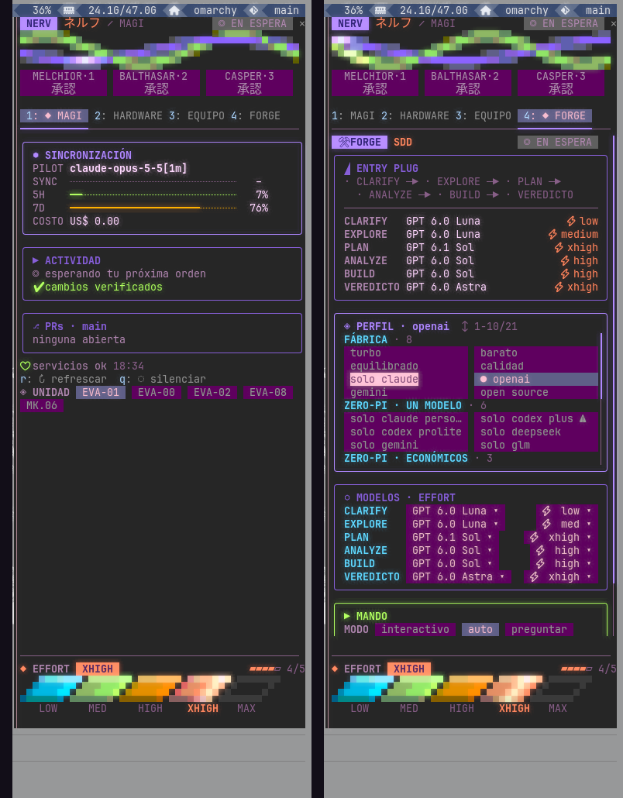

# NERV — barra lateral estilo Evangelion para Claude Code

Un **mod** de Claude Code (v2.1.287 o más nuevo) que agrega una barra lateral con estética NERV:
qué está haciendo el agente, cuánto contexto y cuota te queda, tus PRs, tu máquina, tus otras
sesiones y un panel para manejar [forge](https://github.com/gonzalonicolasr/claude-code-forge).



## Qué muestra

La cabecera queda siempre fija: dos cintas de neón animadas, la tríada **MAGI** (MELCHIOR,
BALTHASAR y CASPER), el estado (en espera u operando) y las pestañas. Abajo, también fijo, está el
**medidor de effort** del modelo. El contenido de cada pestaña scrollea por su cuenta, las tarjetas
largas tienen su propio scroll, y cualquier tarjeta se pliega con un click en su `▾` (arrancan
abiertas y lo que pliegues queda guardado).

- **1 · MAGI**
  - **Sincronización:** modelo, contexto (SYNC), cuota de 5 h y 7 días, y costo de la sesión. Con
    el contexto o la cuota arriba del 85 % pasa a **BATERÍA INTERNA**: se pone roja y estima cuánto
    tiempo te queda al ritmo actual.
  - **Actividad:** qué herramienta está corriendo y hace cuánto, archivos editados **sin verificar**
    y **PATTERN BLUE** cuando el mismo error se repite tres veces.
  - **Tareas:** comandos y subagentes en segundo plano, con su estado.
  - **ÚLTIMA MISIÓN:** si la sesión anterior en esa carpeta se cortó sin cerrarse, te muestra el
    último pedido.
- **2 · GIT**
  - **Rama:** upstream, commits adelante y atrás, y cambios sin commitear.
  - **Commits:** un mapa de calor como el de GitHub, de frío a caliente, con el total, la racha de
    días seguidos y los commits de hoy.
  - **Últimos commits** y las **PRs abiertas del repo**, con su estado de review y de checks, como
    links.
- **3 · HW:** GPU, VRAM, CPU y RAM con un gráfico animado, periféricos, monitores y máquinas
  secundarias.
- **4 · EQUIPO:** tus sesiones de [herdr](https://herdr.dev), con las que te necesitan primero.
- **5 · FORGE:** el panel de forge: fases, perfiles, modelo y effort por fase, modo, rondas y el
  botón para iniciar una corrida.

Además, el spinner de "pensando" se reemplaza por un escáner animado con verbos EVA
("Sincronizando", "Consultando a MAGI"…) y el `SYNC` de contexto. Cuando un comando que fallaba
pasa, sale un confeti. En los turnos de más de 3 minutos llega una notificación **MISSION COMPLETE**.

## Requisitos

- Claude Code **2.1.287** o más nuevo, con `"tui": "fullscreen"` en tus settings. Como barra
  lateral necesita al menos **110 columnas**, y para abrirse sola al arrancar, **144**. En una
  ventana más angosta se muestra arriba del prompt.
- Una terminal con colores de 24 bits. Ghostty, kitty y WezTerm andan bien.
- Opcionales: cada sección se apaga sola si falta lo suyo.
  - `gh` para las PRs y el CI.
  - [herdr](https://herdr.dev) para EQUIPO.
  - `~/.local/bin/jcode-rail --json` para HARDWARE.
  - forge para la pestaña FORGE.

## Instalación

```bash
git clone https://github.com/gonzalonicolasr/claude-code-nerv ~/claude-code-nerv
claude --plugin-dir ~/claude-code-nerv
```

Para cargarlo en todas tus sesiones, agregá a `~/.claude/settings.json`:

```json
{ "env": { "CLAUDE_CODE_PLUGIN_DIRS": "/ruta/a/claude-code-nerv" } }
```

Si tenés varios mods, separalos con `:`.

## Comandos

| Comando | Qué hace |
|---|---|
| `/nerv` o `/nerv on` | Abre la barra |
| `/nerv quiet` | La esconde y apaga las animaciones (para grabar o compartir pantalla) |
| `/nerv magi` · `git` · `hw` · `equipo` · `forge` | Va a esa pestaña |
| `/nerv tema eva01\|eva00\|eva02\|eva08\|mark06` | Cambia los colores de todo el panel |
| `/nerv prs` | Refresca las PRs |
| `/nerv debug` | Muestra el estado interno |

Con la barra enfocada, las teclas `1` a `5` cambian de pestaña. Todo lo que se ve como botón se
puede clickear.

## Temas

| Tema | Colores |
|---|---|
| `eva01` | violeta y verde ácido (el de fábrica) |
| `eva00` | azul, blanco y amarillo |
| `eva02` | rojo, naranja y dorado |
| `eva08` | rosa y verde |
| `mark06` | azul marino y plata |

El tema elegido se guarda y también se escribe en `~/.local/state/nerv/theme.json`, para que
otros mods puedan leerlo.

## Desarrollo

```bash
claude plugin validate .
claude plugin test .
```

Mientras lo usás con `--plugin-dir`, Claude Code lo recarga solo cada vez que guardás
`hooks/register.ts`.
